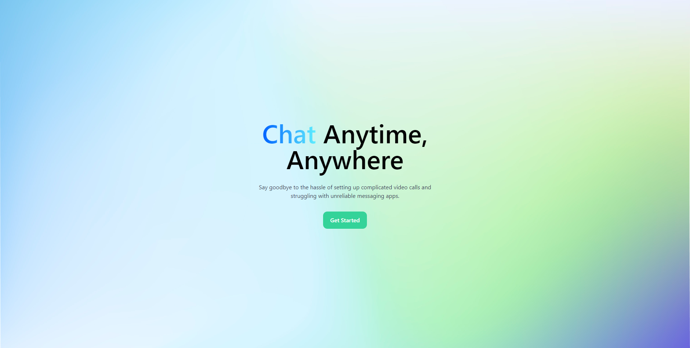
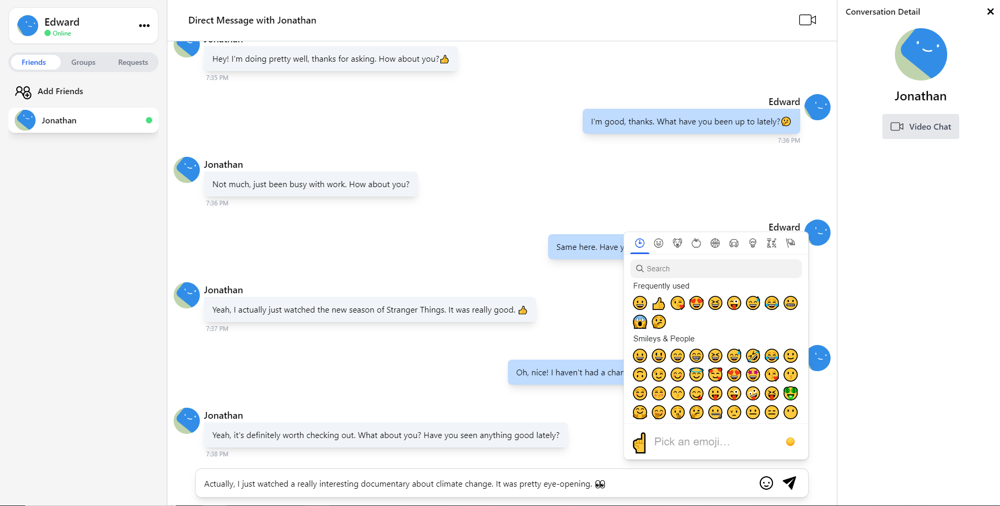
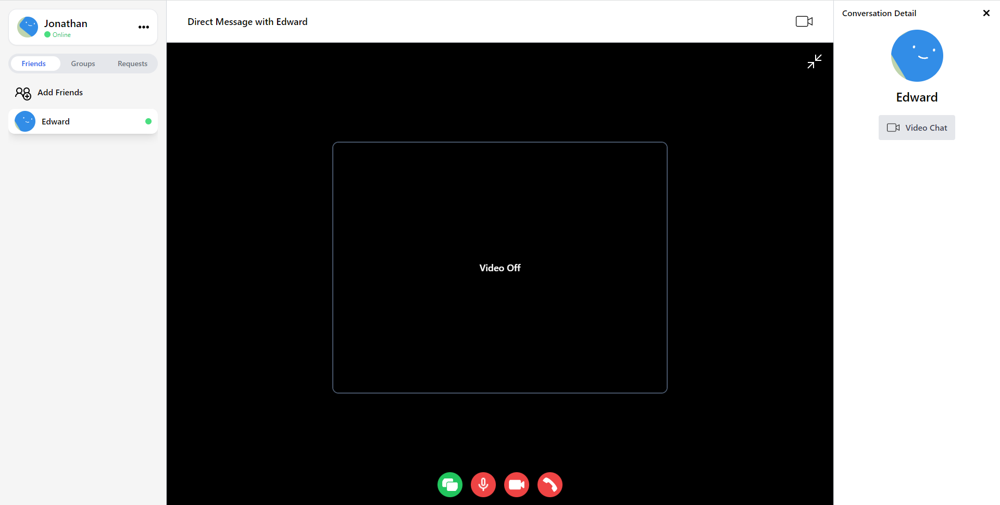

   
   
   
   
  
   
   
   
   

# QuickChat

Quickchat is a chat application that allows users to connect and communicate in real-time. With Quickchat, users can easily create accounts, find and add friends, and start conversations with individuals or groups. Quickchat is designed to be fast, simple, and intuitive, with a clean and modern interface that makes it easy to use

Project is live on [quick-chat.app](https://quick-chat.app/)

## Documents

Design Documentations can be found [here](./documentations).

## Screenshots

  
  
  

## Features

- Real-time messaging
- Group chats
- Direct messaging
- Message history & fetch message
- Emojis support
- Audio and video calls
- Multi-device compatibility
- Responsive Layout
- Online indicators
- User authentication
- Avatar
- Rate Limiter
- Screen sharing
- Firends list
- Group Chat All Participants info
- Friend Requests

## Technologies

### Frontend

| Technologies                                                                                                      | Description                                                                                                                         |
| ----------------------------------------------------------------------------------------------------------------- | ----------------------------------------------------------------------------------------------------------------------------------- |
| [React.js](https://reactjs.org/)                                                                                  | Javascript Library for building user interfaces                                                                                     |
| [React Hooks](https://reactjs.org/docs/hooks-intro.html)                                                          | New addition in React 16.8 that let you use state and other React features without writing a class                                  |
| [React Router v6.4.2](https://reactrouter.com/en/main)                                                            | Javascript standard library for routing in React                                                                                    |
| [Axios](https://www.npmjs.com/package/axios)                                                                      | Node.js packages that implements the Promise API and used to make HTTP Requests                                                     |
| [Redux.js](https://redux.js.org/)                                                                                 | An open-source JavaScript library for managing and centralizing application state.                                                  |
| [Redux toolkit](https://redux-toolkit.js.org/)                                                                    | Redux official, opinionated, batteries-included toolset for efficient Redux development                                             |
| [Redux DevTools](https://chrome.google.com/webstore/detail/redux-devtools/lmhkpmbekcpmknklioeibfkpmmfibljd?hl=en) | Chrome extensions that helps for debugging Redux state                                                                              |
| [Emoji-mart](https://www.npmjs.com/package/emoji-mart/v/5.5.2)                                                    | Node.js packages that is a customizable emoji picker                                                                                |
| [Vite](https://vitejs.dev/)                                                                                       | Modern dev & build tool for JavaScript projects                                                                                     |
| [Socket.io-client](https://www.npmjs.com/package/socket.io-client)                                                | Node.js packages that enables real-time bidirectional communication between a web browser and a server using the WebSocket protocol |

### Backend

| Technologies                                         | Description                                                                                                |
| ---------------------------------------------------- | ---------------------------------------------------------------------------------------------------------- |
| [Node.js](https://nodejs.org/en/)                    | An open-source server environment                                                                          |
| [Express.js](https://expressjs.com/)                 | A back end web application framework for building RESTful APIs with Node.js                                |
| [Dotenv](https://www.npmjs.com/package/dotenv)       | Node.js packages that loads environment variables from .env file into process.env                          |
| [Cors](https://www.npmjs.com/package/cors)           | Node.js packages that can be used to enable CORS with various options                                      |
| [Bcrypt.js](https://www.npmjs.com/package/bcryptjs)  | Node.js packages that enables storing of passwords as hashed passwords instead of plaintext                |
| [Google Domain](https://domains.google/)             | A domain name registrar operated by Google.                                                                |
| [Redis](https://www.npmjs.com/package/redis)         | node-redis is a modern, high performance Redis client for Node.js.                                         |
| [Helmet](https://www.npmjs.com/package/helmet)       | Help secure Express/Connect apps with various HTTP headers                                                 |
| [PostgreSQL](https://www.postgresql.org)             | a free and open-source relational database management system emphasizing extensibility and SQL compliance. |
| [Sequelize](https://www.npmjs.com/package/sequelize) | Node.js ORM for PostgreSQL                                                                                 |
| [Socket.io](https://www.npmjs.com/package/socket.io) | Node.js packages that enables real-time bidirectional event-based communication                            |
| [uuid](https://www.npmjs.com/package/uuid)           | Node.js packages that generate unique ID                                                                   |

### Dev Tools

| Technologies       | Description                                                               |
| ------------------ | ------------------------------------------------------------------------- |
| Visual Studio Code | Code Editor                                                               |
| Postman            | API platform for developers to design, build, test and iterate their APIs |

## Improvement

- Support file sharing.
- Allowing users to upload their avatar
- Voice messages
- Chatbot intergrations
