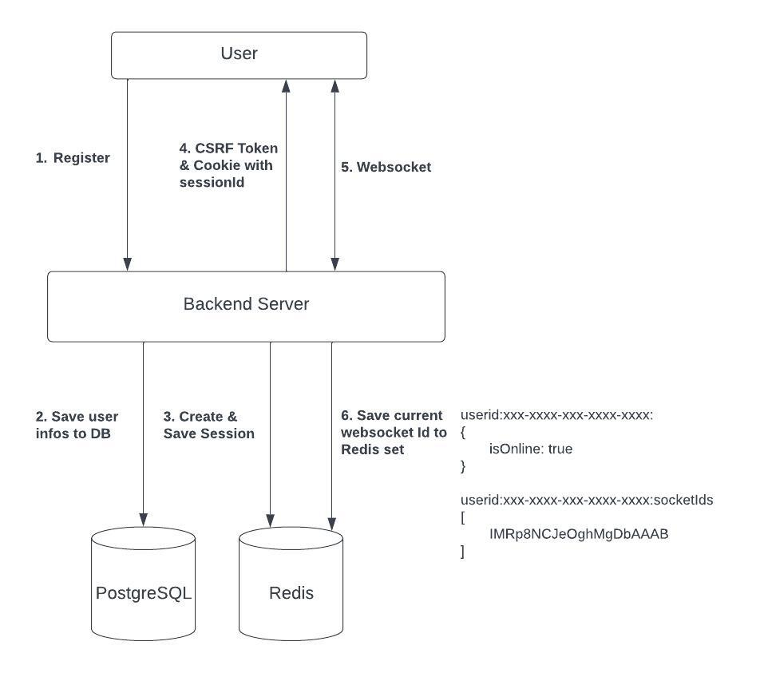
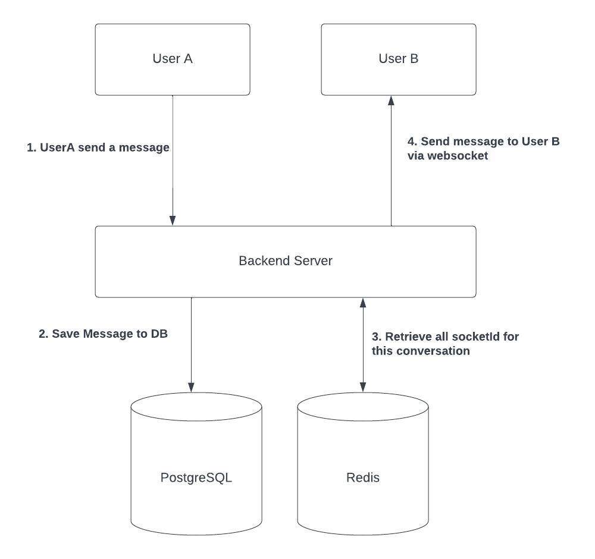
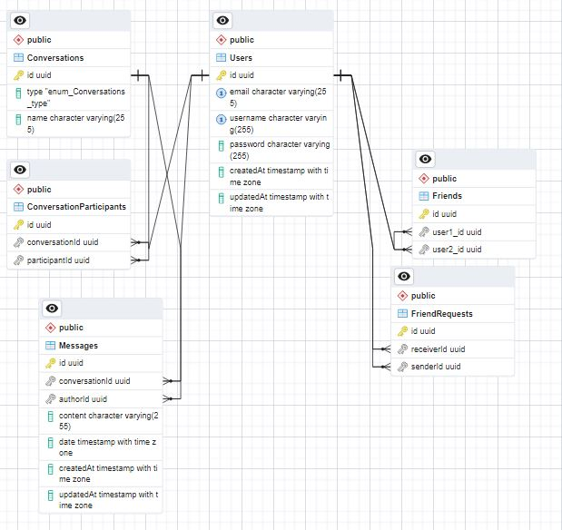

# System Design Document

## Introduction

The purpose of this project is to develop a chat application that supports real-time communication and 1v1 video calling using webRTC and webSockets. The chat app provides a convenient and quick way for people to communicate with their friends directly or involve in a group chatting. The goal of this project is to learn and develop an application that involves real-time communications, including websockets instead of the normal http.

## Assumptions and Constraints

The following assumptions and constraints apply to this system design:

<ul>
  <li>The chat app will be developed using webRTC and webSockets for real-time communication.</li>
  <li>The chat app will use session authentication for user management.</li>
  <li>The chat app will be developed using Node.js and React.js.</li>
  <li>The chat app will use session authentication for user management, with session information stored in Redis for fast lookup.</li>
  <li>The chat app will store necessary information about websockets in Redis for fast, performance lookup.</li>
  <li>The chat app will use PostgreSQL for the database to store user information and chat messages.</li>
  <li>The chat app will be hosted on Netlify for the frontend and Railways.app for the backend.
</li>
  <li>The chat app will be developed within a limited timeframe of 4-6 weeks.
</li>
</ul>

## Architecture

### High-Level Architecture

The chat app is a web-based application that consists of two main components: the frontend component, which is built using React.js, and the backend component, which is built using Node.js and uses Express.js as the web framework. The frontend and backend components communicate with each other using websockets and APIs. The chat app also includes Redis for session management, PostgreSQL for the database, and webRTC for real-time communication and 1v1 video calling.

## Functional Requirement

<ul>
  <li>User Authentication: Users must be able to register, login, and create and manage their profile.</li>
  <li>Sending and receiving messages: Users must be able to send messages to other users and receive messages from them in real-time.</li>
  <li>Group chat functionality: Users must be able to create and join chat groups, and send messages to all members of the group.</li>
  <li>Online indicator: The app must display an online indicator to show whether a user is currently online and available to receive messages.</li>
  <li>Friend request and adding functionality: Users must be able to add other users as friends, and accept or decline friend requests from other users.</li>
  <li>Emoji support: The app must support emojis for users to use in their chat messages.</li>
  <li>Voice and video calling: The app must support voice and video calling functionality to allow users to communicate using voice or video.</li>
  <li>Multi-device support: The app must support users logging in and accessing their chats from multiple devices, such as a phone and a computer.</li>
  <li>Accessibility features: The app must be designed with accessibility in mind, including features such as high-contrast mode, screen reader compatibility, and adjustable font sizes.</li>
  <li>Persistent storage of chat history: The app must store chat history in a persistent manner so that users can view their past conversations at a later time. The chat history must be searchable and organized by date, time, and user.</li>
</ul>

## Non-functional Requirement

<ul>
  <li>Low Latency: We want users to be able to chat in real time, so low latency is pretty important</li>
  <li>Performance: The app must load within 3 seconds on average, and must be able to handle 1,000 simultaneous users.</li>
  <li>Security: The app must use encryption to protect user account, and must comply with relevant data privacy regulations.</li>
  <li>Usability: The app must be user-friendly and easy to navigate, with a clean and intuitive user interface.</li>
  <li>Compatibility: The app must be both mobile and desktop responsive</li>
  <li>Reliability: The app must be stable and reliable, with minimal downtime and error rates.</li>
  <li>Scalability: The app must be able to handle increasing numbers of users and data without compromising performance or functionality.</li>
  <li>Accessibility: The app must be designed to be accessible to users with disabilities, such as those who are blind or visually impaired.</li>
</ul>

## Architecture Diagram

## Sending Messages Diagram

## WebRTC work flow Diagram

## System Components

The chat app consists of the following components:

<ul>
  <li>
    Frontend Component: The frontend component is responsible for rendering the user interface for the chat app, including the login and registration pages, the chat room and direct message interfaces, and the video call and screen sharing interfaces.
  </li>
  <li>
    Backend Component: The backend component is responsible for handling the business logic of the chat app, including user management, chat management, and authentication management.
  </li>
  <li>
    Redis: Redis is used to store session information for user management and to store necessary information about websockets for fast, performance lookup.
  </li>
  <li>
    PostgreSQL: PostgreSQL is used to store user information and chat messages.
  </li>
  <li>
    webRTC: webRTC is used for real-time communication and 1v1 video calling between users.
  </li>
</ul>

## Data Management

The following data flow diagrams show the flow of data within the chat app for different use cases:

<ul>
  <li>
    Sending a message: When a user sends a message, the message is sent over websockets to the backend component, which stores the message in the database and sends the message to the appropriate chat room or direct message via websocket.
  </li>
  <li>
    Making a video call: When a user initiates a video call, the call request is sent over websockets to the backend component (signaling and delivering necessary informations such as ICE candidates), which establishes a webRTC connection between the users and enables video and audio transmission.
  </li>
</ul>

## Data Models

### Conversation

| Column | Type   | Description                                          |
| ------ | ------ | ---------------------------------------------------- |
| id     | UUID   | Unique Id for Current Conversation and is used as PK |
| type   | STRING | either "direct" or "group"                           |
| name   | STRING | Name for Current Conversation                        |

### ConversationParticipant

| Column         | Type | Description                                   |
| -------------- | ---- | --------------------------------------------- |
| id             | UUID | Unique Id used as PK                          |
| conversationId | UUID | Foreign Key referencing to Conversation Model |
| participantId  | UUID | Foreign Key referencing to User Model         |

### Friend

| Column   | Type | Description                           |
| -------- | ---- | ------------------------------------- |
| id       | UUID | Unique Id used as PK                  |
| user1_id | UUID | Foreign Key referencing to User Model |
| user2_id | UUID | Foreign Key referencing to User Model |

### FriendRequest

| Column     | Type | Description                           |
| ---------- | ---- | ------------------------------------- |
| id         | UUID | Unique Id used as PK                  |
| receiverId | UUID | Foreign Key referencing to User Model |
| senderId   | UUID | Foreign Key referencing to User Model |

### Message

| Column         | Type   | Description                                    |
| -------------- | ------ | ---------------------------------------------- |
| id             | UUID   | Unique Id used as PK                           |
| conversationId | UUID   | Foreign Key referencing to Conversation Model  |
| authorId       | UUID   | Foreign Key referencing to User Model          |
| content        | STRING | Message content                                |
| date           | DATE   | Exact time (date) when this message is created |

### User

| Column   | Type   | Description                             |
| -------- | ------ | --------------------------------------- |
| id       | UUID   | Unique Id used as PK                    |
| email    | STRING | Unique email used to identify a user    |
| username | STRING | Unique username used to identify a user |
| password | STRING | hashed password for current user        |

### Database Model Association

 
 

<ul>
  <li>A User can have many Friend</li>
  <li>A User can send many Friend Requests</li>
  <li>A User can receive many Friend Requests</li>
  <li>A User can have many Messages</li>
  <li>A User can have many conversation</li>
  <li>A conversation can have many user</li>
  <li>A Message can only belongs to a Conversation</li>
  <li>A Message can only belongs to a User</li>
</ul>

## Frontend Routes

### Public Routes

| Routes    | Description            |
| --------- | ---------------------- |
|           | Landing Page           |
| /login    | Login Page             |
| /register | Register Page          |
| /legal    | Terms Of Services Page |
| /privacy  | Privacy Policy Page    |
| /\*       | 404 Not Found Page     |

### Private Routes

| Routes     | Description    |
| ---------- | -------------- |
| /dashboard | Dashboard Page |

## Backend REST API Routes

| Endpoint                                        | Request type | Description of the request/response                                                                                                          |
| ----------------------------------------------- | ------------ | -------------------------------------------------------------------------------------------------------------------------------------------- |
| /api/auth/checkAuth                             | GET          | Return HTTP 200 if current session is active, else return HTTP 401                                                                           |
| /api/auth/register                              | POST         | Signup user account, return 201 with CSRF Token if success, else return 409 with error message                                               |
| /api/auth/login                                 | POST         | Login user account, return 200 with CSRF Token if success, else return 400 with error message                                                |
| /api/auth/logout                                | POST         | Perform action to delete current session and current cookie. Return 500 if unsucess                                                          |
| /api/messages/chat-history/:conversationId      | GET          | Retrieve 10 old chat history. query: topMessageTime, which represents the lower bound to start with when finding 10 oldest message           |
| /api/messages/chat-participants/:conversationId | GET          | Retrieve all participants that belongs to a conversation. No need of CSRF Token because CSRF is Blind attack and won't work for GET requests |

## Frontend Websocket Routes

| Frontend Websocket listening on | Description of the request/response                                               |
| ------------------------------- | --------------------------------------------------------------------------------- |
| get-username                    | if received username, save it to redux store                                      |
| friend-online                   | if a friend is online, update redux state                                         |
| friend-offline                  | if a friend is offline, update redux state                                        |
| friend-list-online              | if received a list of friend who are online, save it to redux store               |
| friend-list-offline             | if received a list of friend who are offline, save it to redux store              |
| new-friend-online               | if accept a new friend, update to online friend lists in redux store              |
| new-friend-offline              | if accept a new friend, update to offline friend lists in redux store             |
| friend-requests-list            | if received a list of friend requests, save it to redux store                     |
| friend-request                  | if received a friend request, update it to redux store                            |
| new-chat-message                | if received a new chat message, update the redux messages state                   |
| groups-chatroom-list            | if received a list of chatroom the user is participant to, save it to redux store |
| new-groups-chatroom             | if join a new group chat room, update it to redux state                           |

## Backend Websocket Routes

| Backend Websocket listening on | Description of the request/response                                                |
| ------------------------------ | ---------------------------------------------------------------------------------- |
| disconnect                     | Disconnect the current websocket connection                                        |
| send-message                   | Send direct message / broadcast message to group chat                              |
| send-friend-request            | Send friend requests and notify receiver in real time                              |
| accept-friend-request          | Accept friend requests and save it to DB and send real time notification to sender |
| reject-friend-request          | Delete current friend request                                                      |
| create-group-request           | Create an group chat and save it to DB                                             |
| join-group-request             | Join a chat room and notify all chatroom user                                      |

## Frontend WebRTC signaling via WebSocket Routes

| Frontend Websocket listening on | Description of the request/response                                                      |
| ------------------------------- | ---------------------------------------------------------------------------------------- |
| send-rtc-offer                  | if recieved an offer, call the function createAnswer                                     |
| send-rtc-answer                 | if received an answer, call the add answer function                                      |
| send-ice-candidate              | if received Ice candidates, add it to current peerConnection Object                      |
| user-leave                      | if the remote user leaved the chatroom, close the peerConnection and reset remote stream |

## Backend WebRTC signaling via WebSocket Routes

| Backend Websocket listening on | Description of the request/response                                                                                         |
| ------------------------------ | --------------------------------------------------------------------------------------------------------------------------- |
| join-video-room                | if received join video room request, add the current sessionId to Redis set starting with videoConversationId               |
| leave-video-room               | if received leave video room request, remote the current sessionId from Redis set starting with videoConversationId         |
| send-rtc-offer                 | if received an request to broadcast RTC offer, it will broadcast all sessionId that is currently in the videoConversationId |
| send-rtc-answer                | If received an requests to send answer, it will send the rtc answer to speicify socketId                                    |
| send-ice-candidate             | If received an requests to send Ice-candidate, it will broadcast the ice-candidates                                         |

## Security

The chat app uses session authentication for user management, with session information stored in Redis for fast lookup. When a user logs in, the chat app backend server will generates a session ID along with other necessary informations that identifies a user, and this session ID will be send and stored in a httpOnly cookie to client's browser, and this session ID will be used to identify the current user for later operations. Since we are using session authentications, it is vulnerable to CSRF attack. Hence when the client made successful login, the backend will send an HTTPs response with CSRF Token along with the httpOnly Cookie that contains sessionID. The client will store the CSRF Token in its localstorage and will be included for future requests to help backend server identify a user and improve security. Some will worried about saving to localstorage will be vulnerable to XSS attack and should be saved instead to other places such as session storages or httpOnly Cookies. But if someone is able to hack your website using XSS, the places that you store is not important, as they just directly perform the action they want, without the need to know what's the csrf token & session ID. Once the user login to its account, he will be automatically redirected to the dashboard page. And when the dashboard page is render, it will try to connect to the websocket in a React useEffect hook. If we want to level up the securtiy and make the project more secure, I should pass in the CSRF token for each websocket communication. However, unlike cookie, websocket connection is far less vulnerable to XSS attack as cookie will be bring by broswer for all requests made within same domain (including subdomain).

## Conclusion

In conclusion, the chat app is a web-based application that supports real-time communication and 1v1 video calling using webRTC and webSockets. The chat app is designed to be simple and intuitive, with a responsive layout that adapts to different screen sizes. The chat app uses a STUN server for NAT traversal and to enable communication between users behind firewalls. The chat app uses websockets for real-time messaging and session authentication for user management, with session information stored in Redis for fast lookup.
