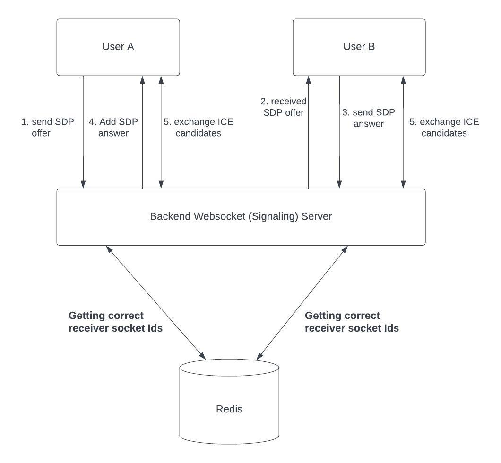

# Technical Specification Document

## Introduction

This technical specification document provides a detailed description about the implementations of the functional requirements of the system.

## Auth

I am using session authentication for this project. whenever a user successfully login / register / authenticated, a sessionID will be generated and save in my session storage (redis).

Then this sessionID will be stored in client's frontend inside the http-only cookie. After that every requests the user make will needs includes this session id in the cookie.

Session auth is vunlable to CSRF attack. In this case, I will also generate an CSRF token after the user is being authenticated. Then this CSRF token will be saved in Localstorage and will be included in future post / delete / put requests. We don't need CSRF Token for GET requests because CSRF attack is a blind attack. I understand that saving CSRF token in localstorage will make it vunlable to XSS attack, but I believes that if XSS happens then no matter where I store (hidden form, http-only cookie, or session storage) it will not be safe, and I should do other implementations such as adding Content Security Policy (CSP) to help protecting from XSS attack. If a theif is already in your house, then no matter how much you renforce the door they will still steal everything from you.

Of course there exists much safer solutions, but the implementaiton above is enough as this chat app is not vunlable to any real money (like bank account or payment infos..) and the above implmentaions is good enought for 99% of the time.

Whenever a user logout, they will send a http requests to the backend, which will make sure it deletes the current session from redis and destroy the cookie containing the sessionID.

Moreover, this project supports long login features, which allows user to login directly without the need to login again if they didn't manually signout within 24 Hours. Session is set to expired after 25H, and the cookie is set to be exipred after 24H. If the user tried to login after his session is expired, he will be automatically logout and redirected to login page. The user will need to login every 25H, even he just opened this app at the 24.9H, he will be log out after 0.1H. I know we can optimize this user experiences by reseting session expirations time everytime user fetches a requests, but currently I am pretty happy with the current implementaions.

Moreover, to make my website more secure, I used npm pacakges Helmet for node.js express server, as Helmet provides various middleware functions that can help secure your application against common web vulnerabilities such as cross-site scripting (XSS), cross-site request forgery (CSRF), and clickjacking.

## Sending and receiving messages

Communication between client and server will be carried out through websockets. The websocket server will be configured to listen on the "send-message" endpoint. When the client sends a message to this endpoint, the websocket server will store the message in a PostgreSQL database, retrieve the necessary information such as the receiver's socket ID from Redis, and then use websockets to transmit the message to the intended receiver in real-time. To determine the appropriate socketId to which a message should be sent, we will retrieve the userId of all participants involved in the conversation. For direct messages, there will be only two participants, the sender and the recipient. For group messages, there may be multiple participants. Regardless of whether it is a group or direct message, we will exclude the sender's own socketId and send the message to all conversation participants who are currently online.

## Emoji support

Sending emojis is a simple task, mainly handled in the frontend. I have incorporated the Emoji-mart npm library, which includes a pre-built emoji picker, to facilitate the process.

## Online indicator

We determine whether a user is currently online by checking whether they have an associated socketId. Regardless of whether the user is using a desktop or mobile device, the presence of a socketId indicates that they are currently online. When a user successfully logs in and the server retrieves their friend list, the server checks the socketId associated with each friend's ID. If a socketId exists, the friend is added to the list of online friends. If not, the friend is added to the list of offline friends. We efficiently store this online/offline status in Redis hash, enabling quick checking that takes O(1) time. I see that some people implement this online indicator

## Friend request

Friend requests are transmitted via websockets by sending them to the "send-friend-request" endpoint. Upon receiving a friend request, the backend server saves it to PostgreSQL and checks whether the recipient is currently online. If the recipient is online, they are notified in real-time that they have received a friend request. If a friend request is rejected, the server simply deletes it from the database. If a friend request is accepted, the server processes it by deleting the friend request and creating a new friend using the friend model, which is then saved to PostgreSQL. Both users are notified in real-time via websockets that they are now friends. All requests are transmitted via websockets, with no HTTP requests involved.

## Chat history

The chat history is obtained via an HTTP request, specifically a GET request, which does not require a CSRF token. However, a valid session is still required to access the chat history. When fetching the chat history, the server also checks whether the user is allowed to access the chat history for a particular conversation. This is determined by verifying whether the user is a participant in the conversation. The chat history can be obtained through the HTTP endpoint: /api/messages/chat-history/:conversationId. The conversationId parameter is used to determine which conversation the messages should be retrieved from. An optional query parameter, topMessageTime, can also be included. If it is not provided, the chat history will be fetched using the current time, which represents the most recent message. If topMessageTime is specified, the chat history will be paginated based on that query time, and 10 older messages will be retrieved.

## Voice and Video Calling and WebRTC

For WebRTC, we need a signiling server (our server) and an stun server and an turn server.

for most case a stun server is enough, but stun server is unreliable because most of our modern device sits behind a firewall and we can't get the nat infos from stun, hence we need a turn server to solve this problem.

stun server I will use is the google stun server: stun:stun.l.google.com:19302

We need stun server because we need specific informations about the user such as the unique IP address to establish p2p connection. Firewalls are another common network constraint that can prevent direct P2P communication between two devices. STUN/TURN servers help to bypass firewalls by using a technique called "hole punching" to establish a connection between the two devices. NAT (Network Address Translation) is a common technique used in home and office networks to allow multiple devices to share a single public IP address. However, NAT can cause problems for WebRTC because it changes the IP address and port number of the user's device, making it difficult for two devices to establish a direct P2P connection. STUN/TURN servers help to overcome this problem by discovering the public IP address and port of the user's device and by acting as a relay server if direct P2P communication is not possible.

## Redis

The redis will store two entries for a user when a user logs in.

1. A String data type with key of sessionID and value of session informations such as userID, username, etc...

2. A hash data type with userID as key and property about websocket such as is Online or a list of all the socket ID that this user is currently log in to (in string representation hence parsing is needed when read / write is needed). For the list, I can actually use a redis set, but it will create 3 entries for the user (looks messy) and I think the size of the array won't be much so performance won't be a issue?? or should I??

you may wonder, Why do we need this hash data type?? can't we just store user.isOnline in our session entry?? Well, the reason why I stored it in hash because we need to get information about

whether a user is online or not or his friend is online or not. Therefore, we need a fast method to look up.

If we don't use hash, we will need to iterate our entire redis session, and it will be extremely slow because we will need to do it for each user, and each user will use it multiple time. So, using a hash for redis with O(1) find time is more optimal and scalable.

## Rate Limiter

Implementing a rate limiter is a crucial feature that helps to prevent malicious attempts to overload the backend server with excessive requests. To achieve this, I have utilized Redis to implement the rate limiter, and have written it as middleware, allowing it to easily apply to login and register requests. When a user attempts to login or register, their IP address is saved as a key in Redis, with the associated value representing the number of attempts made within the last 60 seconds. If the number of attempts exceeds 10, the requests will be rejected.

## Messages Deduplication

I believes that we need messages deduplication whenever chat history is being fetched, and it needs to be done on the client side.

Reasons:

I will fetch 10 old chat history when use first enter the chatroom using http protocol and i will use websocket to display any new messages the user receive after he entered the chat room

let's consider the following scenario:

User A entered a chatroom. He already have websocket connected to the app before he enter a chatroom. The moment he entered the chatroom, he sends out a http requests to get 10 oldest chat message. But, this http requests due to many many reasons, is very slow. And before this http requests even reach the server, someone in the chatroom has sent out 2 messages and those two messages are saved in the persistent database and is emited to UserA before that http requests for 10 old messages have even reach the server. In this scenario, User A will receive the 2 new messages first via websocket before the http request returns the 10 old messages.

how to handle deduplication?

Other than a message array, I also have an messageIdSet, which stores only messageId.

Since redux can't store sets, I use an Javascript Object (hashMap) instead of set, which also O(1) Get and set operations.

## Difficulties that I encountered

Here's some bugs / difficulties that I encountered during developement.

Problem 1: CSS 100vh don't work properly in mobile device. We need js to work around.

Solution 1: Use javascript to calculate the window.innerHeight

Problem 2: WebRTC remote Stream is not playing even remote stream were correctly received.

Solution 2: Needs to set video tag for streams to videoRef.current.autoplay = true;
videoRef.current.playsInline = true;

Problem 3: Unable to find Http-only cookies in chrome dev tool.

Solution 3: It is intent behavior. No javascript (including chrome dev tool) should be able to see HttpOnly cookies.

Problem 4: Cookies are not being sent from server to client.

Solution 4: The requests is send using http. Enforcing https solves the problem.

Problem 5: Enforced https, but still get http request instead of https?

Solution 5: This have to do with backend server being hosted on railways.app, which they put a proxy infront of my express server, and using app.set("trust proxy", 1) solves the problem.

Problem 6: Cookie are not sent from server to client.

Solution 6: If frontend and backend is on different domain, the cookie will be identified as 3rd party cookie, and majority of time is ban by the user preferences for privacy. Need to host both server & frontend on same domain.

## Scaling

In this project, I am using redis as session storage as it allows for fast and efficient access to session information. Redis is also designed to be highly scalable, meaning that it can handle large amounts of data and traffic.

I am also using PostgreSQL for my persistent Database even I know other popular chat app such as Discord uses NoSQL Database such as MongoDB or Cassandra. Here's my reasons:

<ol>
  <li>Data for my chat apps are mostly relational</li>
  <li>Support ACID transactions</li>
  <li>I personally prefer SQL database unless I have a very good reason to use NoSQL database such as: High scalability & very low latency</li>
  <li>PostgreSQL is very good at handling many concurrent reads and writes. Also PostgreSQL is highly scalable and can handle large volumes of data and high traffic. This makes it an excellent choice for chat apps that require a large number of users and real-time messaging.</li>
</ol>

Currently the backend have only one server as there aren't much active user. If the number of active user increases, I am thinking of horizontally scaling the backend by adding more server to my backend, and change the hosting platform from railways.app to AWS / Azure with a load balancer palaced in front of the backend servers. I might also have an individual server for websocket to improve the performances.

Currently I am deploying my frontend code to netlify instead of having my backend server to serve the static frontend file. This is because I want to benefit from the global CDN that netlify offers when deploying frontend static pages, and this can greatly improve the initial page loading time for users around the country / world.

To be continue...

## Miscellaneous

I am following ES Modules instead of CommonJS.

Backend Server Domain Name: https://api.quick-chat.app/

Frontend Server Domain Name: https://quick-chat.app/

## Attributions

Icons: Google Material Symbols and Icons

Logos: Canva
